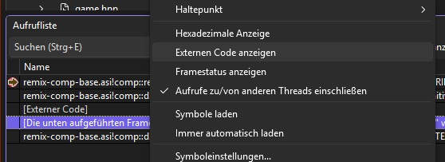
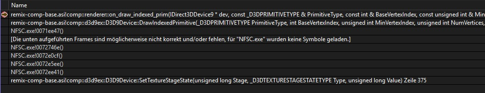
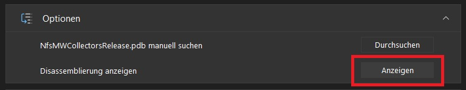
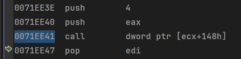
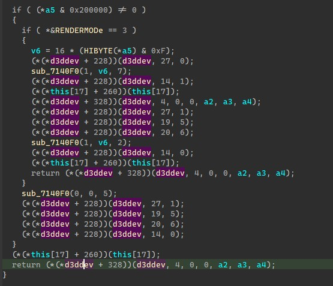
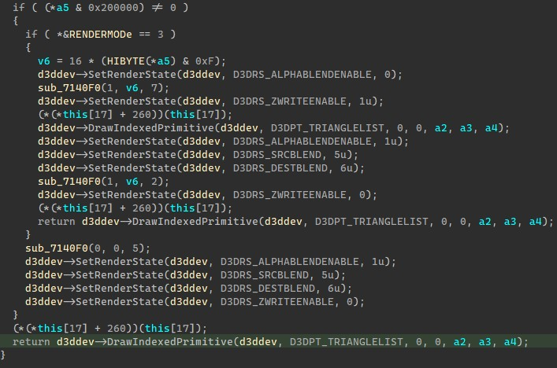
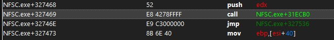
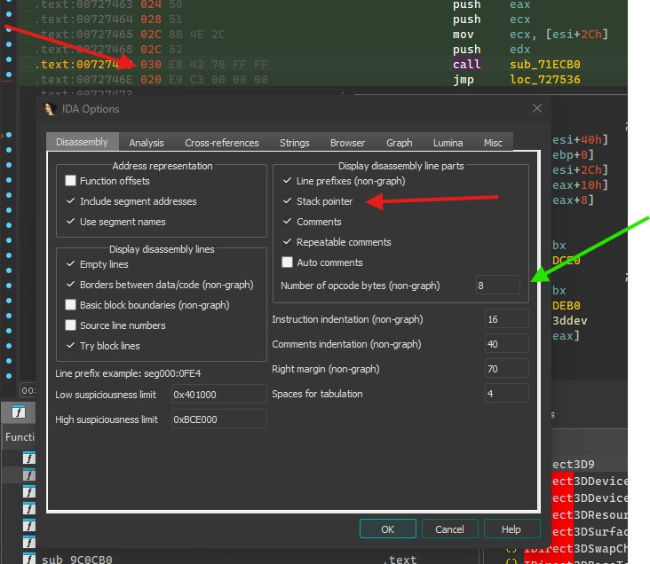
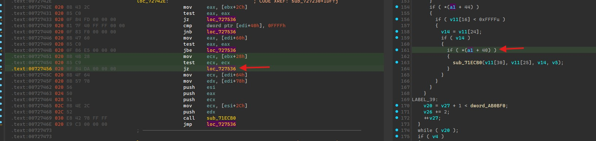
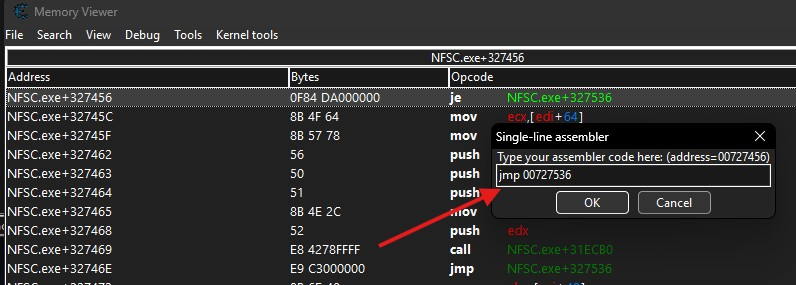

# Identify Drawcalls

> [!WARNING]  
> I won't go into full detail here. You'll have to have some background knowledge on a few things.

1. Go into the game and load a level
2. Set a breakpoint in `renderer::on_draw_indexed_prim()`

3. Once it triggered, look at the callstack. If you see [External Code], right click the window and enable Display external code:   

4. Double click the first Game.exe! offset (NFCS.exe!0081ee47() in this case):  

5. Click on show disassembly. Visual Studio sometimes fails to jump so you might need to double click the address again.  

6. You should end up on the address. The call here is the d3d_device->DrawIndexedPrimitive call that was issued by the game.  

7. Copy that memory address and go to it in IDA or any other disassembler:

8. This repo contains some structs that you can import in ida to make your life easier. If you have not done that yet,  
follow [IDA Structs Guide](ida_structs/USAGE.md) to get this:  

 

You can now x-ref the parent function to see where its called from or further use the call stack to see where the call originated from.   
With some luck and depending how the game was coded, you will be in a render loop of a certain type of object.   
-> If that is the case, follow some of the comments in `renderer.cpp` on how to place hooks that will help you out on a per draw-call basis.

If you want to know what that part of the code draws, you can try to alter code flow and prevent the game from executing this drawcall by using tools like CheatEngine to quickly `nop` out a function call or change a conditional jump to a non conditional jump. 
This is the call to the function that issues the drawcall:  

Simply `nop'ing` this call would be a bad idea. Why? Lets take a look in ida.

 

I've enabled the stack pointer within IDA options. The stack offset at the time of the call is +0x30 and is at +0x20 after the call. This means that the function cleans up the stack and not the "callee" (it is a `thiscall`). Simply nop'ing it would result in a crash because we'd still be at +0x30 when we hit the jmp instruction.

What can we do instead? We could modify a conditional jump:  

If we change that `jz` (`je` in CheatEngine - same thing) to a `jmp`, we will also skip that function call.  
So copy the memory address from ida and use the Assembler view in CE, press Ctrl+G to go to address and paste it there.  
Double click the je instruction and change it to jmp like so:  

If you game did not crash and is now drawing less of something, you've got a clue. If nothing happens, you'll have to investigate what exactly it is the game is drawing or proceed with breakpointing other drawcalls that do not originate from this game function.  
If your game still crashed, try to change earlier code that leads to this codeblock.

> [!NOTE]  
> I've also enabled opcode bytes because these will come in handy once you start to place hooks or create signatures.

> [!NOTE]
> Start naming functions in IDA so you know what kind of objects they handle and keep notes of function addresses that might come in handy later.