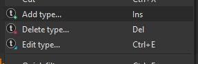
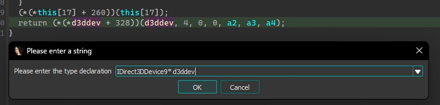

1. Open your ida database 
2. Menubar -> View -> Open Subviews -> Local types  
   

3. Right click the type window and select Add type (or press Insert)  

4. Open one of the two header files, copy all of the content and paste it into the `C syntax` window in ida
5. Repeat for the second header file

6. If you've found a global d3d9 device variable / local var, select it and press `Y`  

7. Change the variable type to `IDirect3DDevice9* d3ddev`  

8. Result:  

____

The same can be done for the d3d9 interface: `IDirect3D9* d3d9`